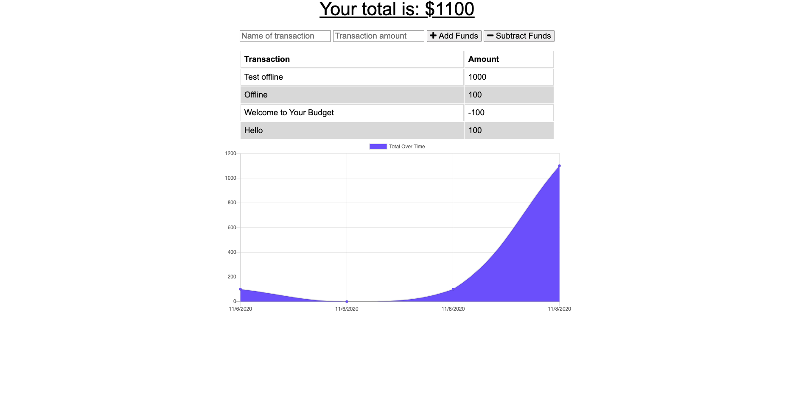

# Track-A-Budget

  ## License
  
  This application is licensed under the Unlicensed license.

  

  ## Description 
  * This project is designed to this application is designed to help keep track of expenses and deposits for your budget and track spending. This application also offfers offline capababilites and pwa metodolgys

  ## Links:

  * Deployed application Url: https://track-a-budget.herokuapp.com/
  * Github Repo: https://github.com/xtreme6007/Track-A-Budgete.git
  
  ## Tabel of contents

> * [Title / Repository Name]
>   * [About](#about)
>   * [Table of contents](#tabel-of-contents)
>   * [Installation](#installation)
>   * [Usage](#usage)
>   * [Screenshots](#sceenshots)
>   * [Resources (Documentation and other links)](#resources)
>   * [Contributers](#contributers)
>   * [License](#license)
>   * [Tests](#tests)
>   * [Questions](#questions)

## Instalation

N/A

## Usage

 through the deployed applications Url

## Screen shots

## Resources

## Contributers
Contributers for this project were:

Preston Nichols

## Tests

N/A

## Questions?
GitHub UserName: xtreme6007@yahoo.com
GitHub Profile: https://github.com/xtreme6007@yahoo.com
Email: prestonnichols96@gmail.com
Please contact me via email for any further question.# Track-A-Budget

  ## License
  
  This application is licensed under the Unlicensed license.

  

  ## Description 
  * This project is designed to this application is designed to help keep track of expenses and deposits for your budget and track spending. This application also offfers offline capababilites and pwa metodolgys

  ## Links:

  * Deployed application Url: https://track-a-budget.herokuapp.com/
  * Github Repo: https://github.com/xtreme6007/Track-A-Budgete.git
  
  ## Tabel of contents

> * [Title / Repository Name]
>   * [About](#about)
>   * [Table of contents](#tabel-of-contents)
>   * [Installation](#installation)
>   * [Usage](#usage)
>   * [Screenshots](#sceenshots)
>   * [Resources (Documentation and other links)](#resources)
>   * [Contributers](#contributers)
>   * [License](#license)
>   * [Tests](#tests)
>   * [Questions](#questions)

## Instalation

N/A

## Usage

 through the deployed applications Url

## Screen shots

## Resources

## Contributers
Contributers for this project were:

Preston Nichols

## Tests

N/A

## Questions?
GitHub UserName: xtreme6007@yahoo.com
GitHub Profile: https://github.com/xtreme6007@yahoo.com
Email: prestonnichols96@gmail.com
Please contact me via email for any further question